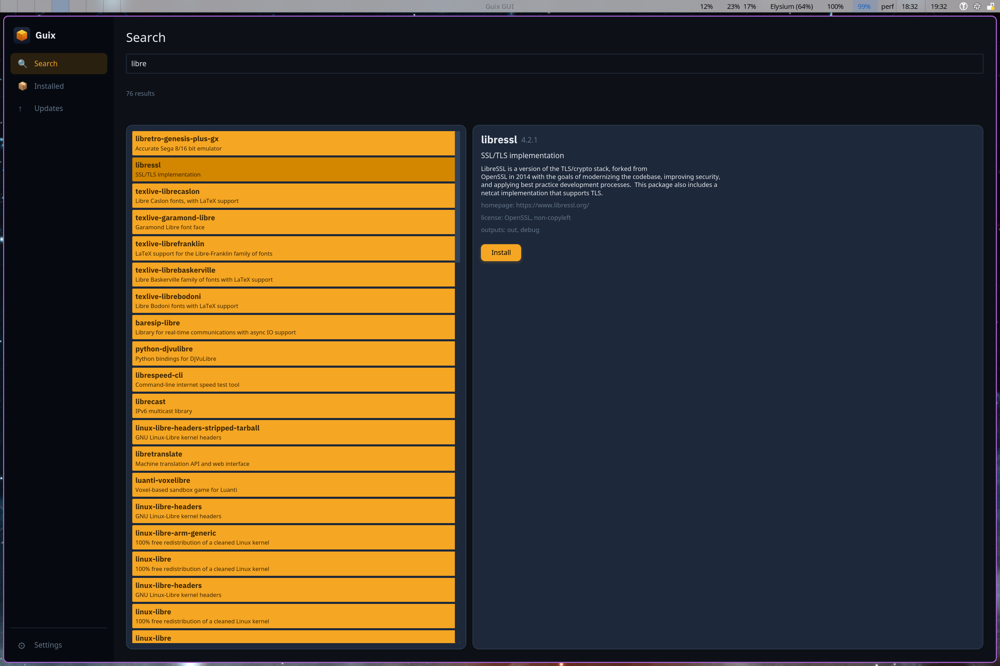
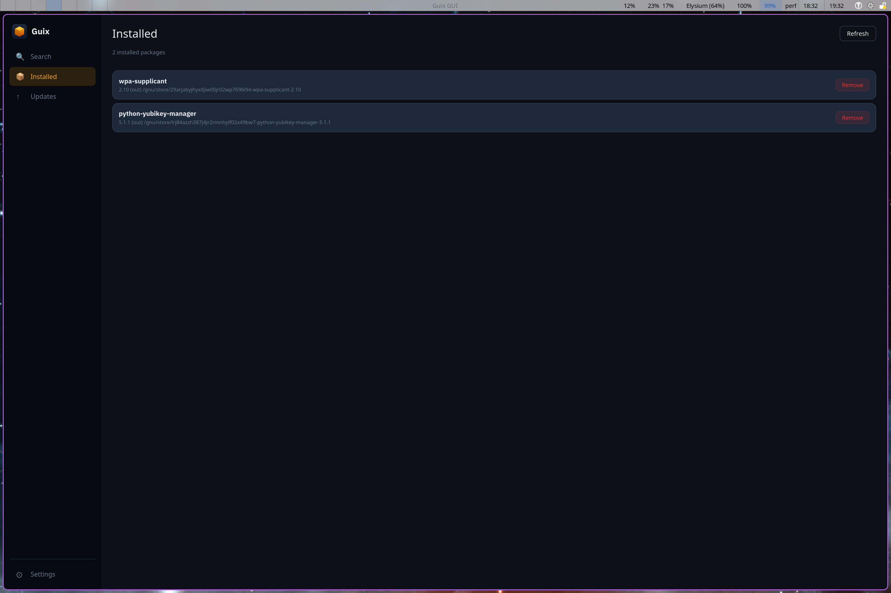
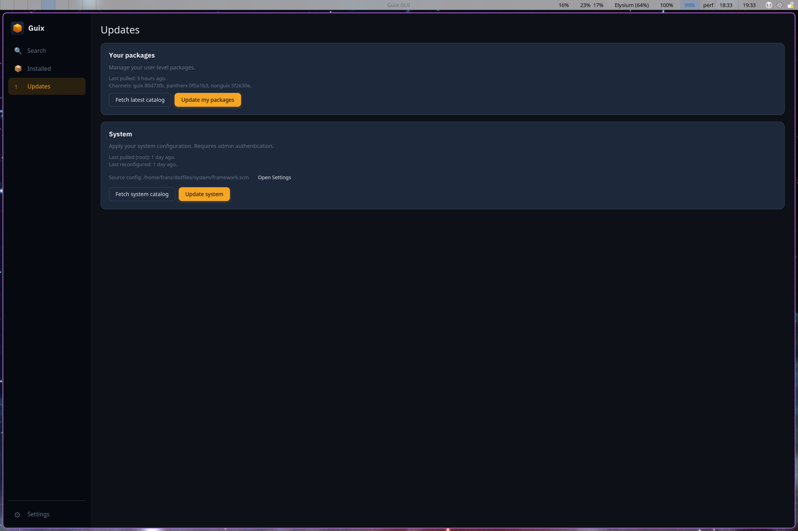
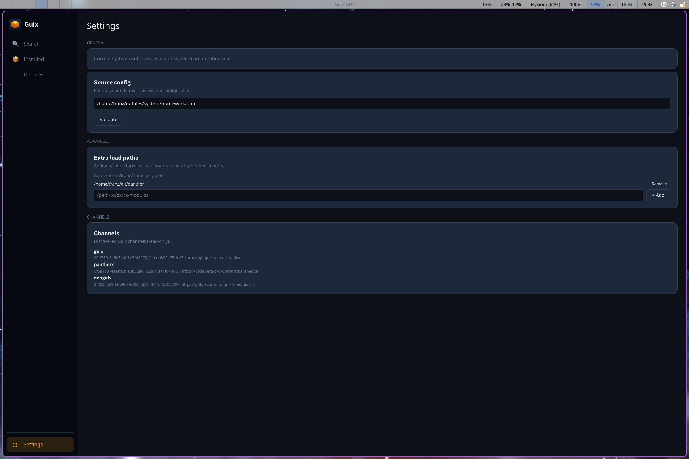

# guix GUI

<p align="center">
  
</p>
<p align="center">
  The unofficial, missing GUI for day-to-day Guix usage — search, install, upgrade, and (with polkit) pull and reconfigure the system.
</p>

## Description

Two pieces: a Rust library (`libguix`) that wraps the `guix` CLI and its machine-readable REPL, and a GUI (`guix-gui`, built on [Iced](https://iced.rs)) that uses the library to search packages, install / remove / upgrade them, and — with polkit — pull and reconfigure the system. The library surface also covers generation listing, switching, and rollback; the GUI doesn't expose those yet.

<p align="center">
  
  
  
  
</p>

## Install — GUI

Packaged on the [panther channel](https://codeberg.org/gofranz/panther). With the channel configured:

```bash
guix package -i guix-gui
```

Or build and run from source:

```bash
cargo run -p guix-gui --release
```

For smoke-testing without mutating your real profile, build with the `dev-temp-profile` feature — install/remove will target a temp profile instead of `$GUIX_PROFILE`:

```bash
cargo run -p guix-gui --release --features dev-temp-profile
```

## Build

The repo has a `manifest.scm` that pins every native dep `libguix` and `guix-gui` need — Rust toolchain, `gcc-toolchain` with `CC` set, `pkg-config`, `openssl` with `OPENSSL_DIR` set, plus the X11 / Wayland / Vulkan / fontconfig stack that Iced 0.13 (on wgpu) requires at build and run time.

```bash
guix shell -m manifest.scm -- cargo build --release
```

Or, à la carte:

```bash
guix shell rust rust:cargo gcc-toolchain -- sh -c "CC=gcc cargo build --release -p libguix"
```

## Usage — library

```toml
[dependencies]
libguix = "0.1"
```

```rust
use libguix::Guix;

let guix = Guix::discover().await?;
for hit in guix.package().search_fast("ripgrep").await? {
    println!("{} — {}", hit.name, hit.synopsis);
}
```

Long-running operations return an `Operation` with a coalesced event stream and a `CancelHandle`:

```rust
use futures_util::StreamExt;
use libguix::ProgressEvent;

let mut op = guix.package().install(&["ripgrep", "fd"])?;
while let Some(batch) = op.events_mut().next().await {
    for evt in batch {
        if let ProgressEvent::Line { text, .. } = evt {
            println!("{}", text);
        }
    }
}
op.await_completion().await?;
```

See `libguix/README.md` and `libguix/src/lib.rs` for the full surface.

## Polkit

Polkit is required **only for the privileged paths** — `SystemOps::reconfigure` and `PullOps::as_root` — both of which need to mutate system state owned by root. Everything else (user-profile install/remove/upgrade, search, generation listing) runs unprivileged against `$GUIX_PROFILE` and needs no agent.

Two custom polkit actions ship under [`polkit/`](polkit):

- `org.libguix.system-reconfigure` — permits `/run/current-system/profile/bin/guix system reconfigure …`
- `org.libguix.system-pull` — permits `/run/current-system/profile/bin/guix pull …` (updates the root catalog at `/var/guix/profiles/per-user/root/current-guix`, which is what `system reconfigure` resolves against)

Both are scoped via argv constraints so they only match the specific subcommand, and both use `auth_admin_keep` so successive calls within polkit's grace window don't re-prompt. Full rationale and install instructions are in [`polkit/README.md`](polkit/README.md).

### Authentication agent

`pkexec` only works if a polkit **authentication agent** is running in your session — the agent is what shows the password prompt. Without one, the privileged calls from the GUI will hang or fail silently. `libguix` detects this case and surfaces a clear error pointing at the polkit README.

Pick whichever agent matches your desktop:

| Agent | Notes |
|-------|-------|
| `lxqt-policykit-agent` | Lightweight, works under any WM. I run this one — `lxqt-policykit-agent &` from my session startup. |
| `polkit-gnome-authentication-agent-1` | GNOME |
| `polkit-kde-authentication-agent-1` | KDE Plasma |
| `mate-polkit`, `xfce-polkit`, `hyprpolkitagent` | matching desktops |

### Install the actions

- **Guix System:** declare the policies via `polkit-service-type`. A reference package (`libguix-polkit`) lives in the [panther channel](https://codeberg.org/gofranz/panther) at `px/packages/libguix.scm` — lift it into any channel. See `polkit/README.md` for the `simple-service` snippet.
- **Foreign distro:** copy both `.policy` files into `/etc/polkit-1/actions/` as root. Polkit picks them up without a restart.

Verify either way:

```sh
pkaction --action-id org.libguix.system-reconfigure --verbose
pkaction --action-id org.libguix.system-pull        --verbose
```

## Packaging

For packagers — the app icon and a reference `.desktop` entry ship under [`assets/`](assets):

- [`assets/icon.svg`](assets/icon.svg) — square SVG. SVG icons are picked up directly by most desktops (GNOME, KDE, LXQt, Xfce) when installed to `share/icons/hicolor/scalable/apps/guix-gui.svg`. For desktops that insist on raster, render PNGs at 48/64/128/256 from the SVG.
- [`assets/guix-gui.desktop`](assets/guix-gui.desktop) — drop into `share/applications/`.

## Development

```bash
guix shell -m manifest.scm -- cargo test
```

`libguix` has a `live-tests` feature that actually shells out to a working `guix` on the host (rather than the controlled subprocess used by default). Off by default; opt in when you want to exercise the real CLI:

```bash
guix shell -m manifest.scm -- cargo test -p libguix --features live-tests
```

Format via Podman (the rustfmt component isn't in the Guix toolchain):

```bash
podman run --rm -v $PWD:/work -w /work rust:latest \
  sh -c "rustup component add rustfmt && cargo fmt"
```

## License

GPL-3.0-only.
